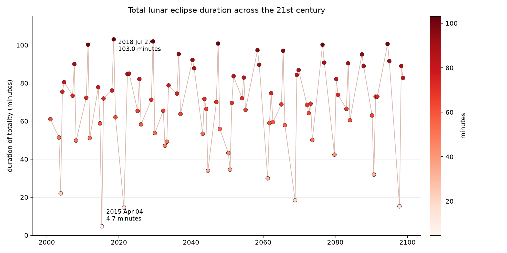

# Total Lunar Eclipse Duration



## The phenomenon

A lunar eclipse occurs when the Moon passes through Earth's shadow. This project focuses on total lunar eclipses, during which the entire Moon enters Earth's umbral shadow. The Moon becomes much darker and may appear red. I chose this phenomenon because every total lunar eclipse follows the same basic process, but the length of totality is not always the same. My picture compares how long the total phase lasts across the 21st century.

## The source

The data comes from NASA Goddard Space Flight Center's [Catalog of Lunar Eclipses: 2001 to 2100](https://eclipse.gsfc.nasa.gov/LEcat5/LE2001-2100.html). Its 228 records describe the date, type, magnitude, phase durations, and location of greatest eclipse for every lunar eclipse in the century. `fetch.py` downloads the original HTML page once and saves the unchanged response in `data/`. The plotting script reads the fixed-width catalogue, selects its 85 total eclipses, and uses NASA's total-phase duration in minutes.

## What the picture shows

Each point represents one total lunar eclipse. Its horizontal position is the date, while its vertical position and colour both show the duration of totality in minutes. Labels identify the shortest and longest events. The chart reveals the wide variation in duration and how it is distributed across the century, but it leaves out the Moon's path through Earth's shadow, visibility regions, observing conditions, and the Moon's actual colour. The red palette is a visual choice and does not represent a colour measurement from NASA.

## Run it

```bash
uv run fetch.py
uv run plot.py
```

After the source page has been cached in `data/`, `plot.py` reads only the local file and can generate the picture without an internet connection.
