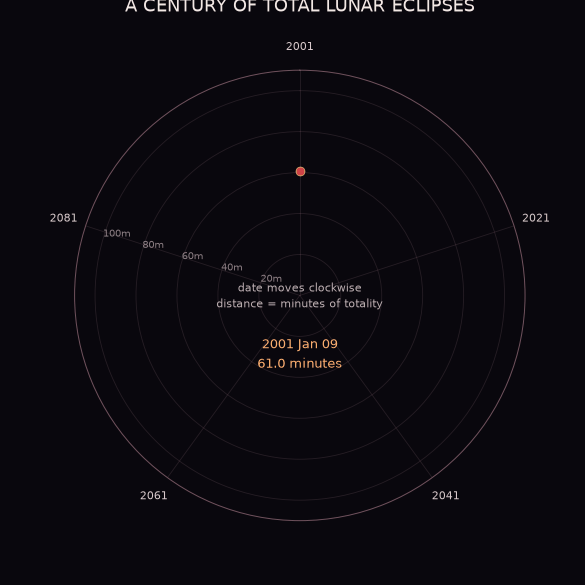

# Total Lunar Eclipse Duration




## The phenomenon

A lunar eclipse occurs when the Moon passes through Earth's shadow. This project focuses on total lunar eclipses, during which the entire Moon enters Earth's umbral shadow. The Moon becomes much darker and may appear red. I chose this phenomenon because every total lunar eclipse follows the same basic process, but the length of totality is not always the same. My picture compares how long the total phase lasts across the 21st century.

## The source

The data comes from NASA Goddard Space Flight Center's [Catalog of Lunar Eclipses: 2001 to 2100](https://eclipse.gsfc.nasa.gov/LEcat5/LE2001-2100.html). Its 228 records describe the date, type, magnitude, phase durations, and location of greatest eclipse for every lunar eclipse in the century. `fetch.py` downloads the original HTML page once and saves the unchanged response in `data/`. The plotting script reads the fixed-width catalogue, selects its 85 total eclipses, and uses NASA's total-phase duration in minutes.

## What the picture shows

The animation builds a century wheel one eclipse at a time. Date moves clockwise around the circle, while distance from the centre, point size, and brightness respond to the duration of totality. The changing radius turns the sequence into an irregular orbit, and labels identify the shortest and longest events. This transformation shows rhythm and variation across the century, but it leaves out the Moon's path through Earth's shadow, visibility regions, observing conditions, and actual colour. The glowing palette is an artistic choice rather than a colour measurement from NASA.

## Run it

```bash
uv run fetch.py
uv run plot.py
uv run animate.py
```

After the source page has been cached in `data/`, `plot.py` reads only the local file and can generate the picture without an internet connection.
