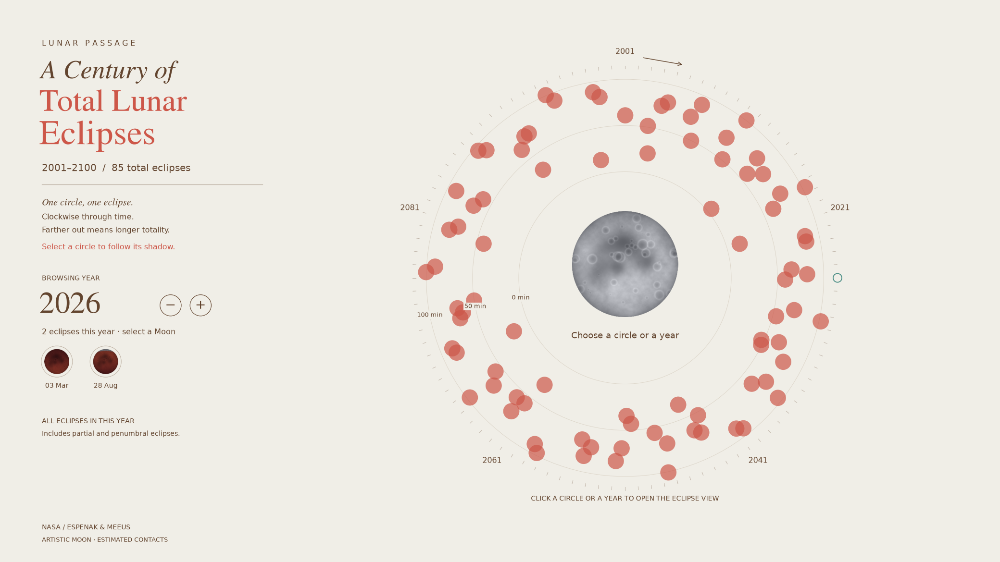
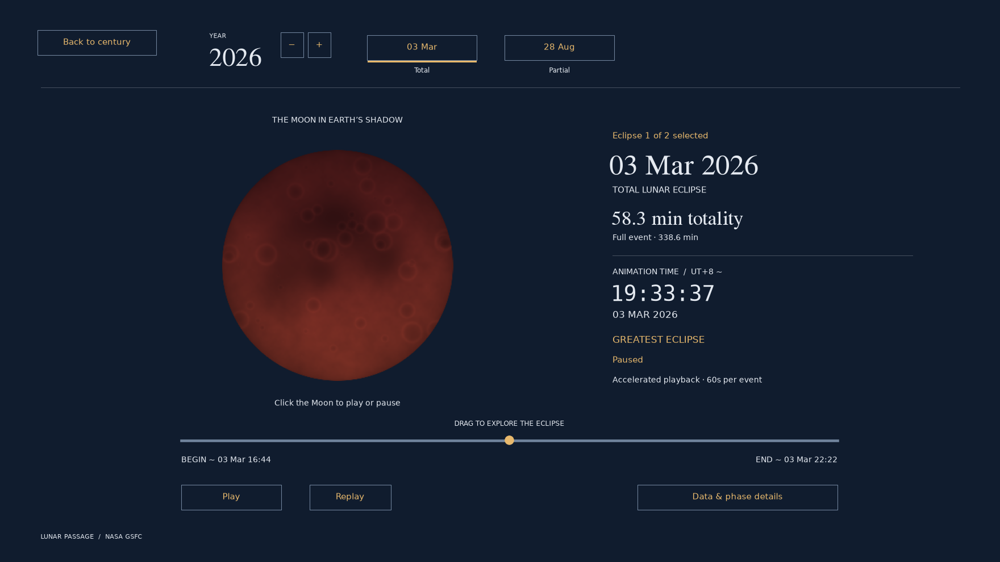
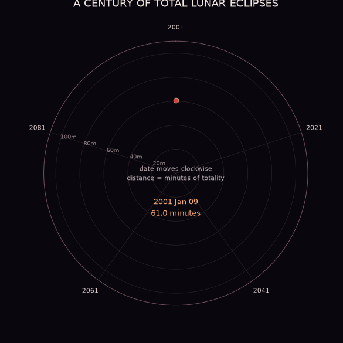
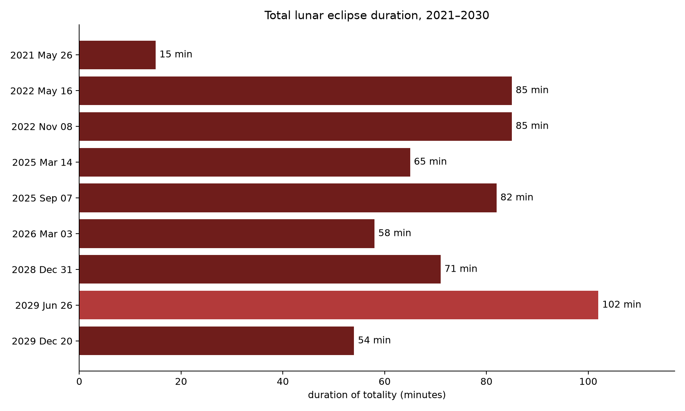

# Lunar Passage — Interactive Century Poster



```bash
uv run atlas.py
```

This opens a **standalone Python window**, with the controls embedded directly
in the artwork. No browser or web server is required. All interface text is English.

- Click a **blue-grey dot** to select and animate that total eclipse.
- The overview is a scatter plot with **year/date on the horizontal axis** and
  **totality duration in minutes on the vertical axis**. Every dot has the same
  size, so position is the only data encoding.
- Hover or click the **year axis**, or use the top +/− controls, to browse a year
  without leaving the overview. An amber vertical band confirms the active year.
  Empty space inside the plot does not trigger navigation.
- Click a **date button beside the year** to select any eclipse in that year,
  including partial and penumbral events not plotted in the totality overview.
- Click the **central Moon or Play/Pause label** to pause or resume.
- Click or drag the **horizontal event timeline** to seek.
- The application starts with a still century overview. Selecting an
  eclipse opens a separate **focus layout in the same native window**. A large
  Moon, adjacent event information, top date selectors, and a long timeline
  replace the century diagram. **Back to century** pauses playback and returns
  with the selected year and event preserved and highlighted.
- **Data & phase details** reveals phase dates/times, full-event duration, scientific limits,
  and clickable time-zone and playback-speed settings. These are not permanent
  panels on the main canvas.
- **Browsing year** and **Eclipse n of N selected** distinguish the year from
  the current event. The event's catalogue date stays fixed in the information
  group beside the Moon; the animation date may change across midnight.
- **Playing**, **Paused**, and **Complete** show the current playback state,
  separately from the Play/Pause/Replay action. Seeking pauses the animation.
  Details temporarily pauses playback and restores its previous state on close.
- The focus view uses a fixed 185-unit Moon radius. Views switch directly;
  there is no animated zoom or bounce.
- Press **F** for fullscreen and **I** for data notes and controls.

Keyboard: Left/Right changes year; Up/Down seeks; `[` / `]` changes event;
Space plays/pauses; R replays; S cycles speed; T changes the time basis.
Tab focuses controls and Enter activates them. `uv run atlas.py --paused`
starts with animation paused. The native window requires a desktop display.

The Moonlit Navy theme uses a deep navy background, soft white typography,
blue-grey data points, and amber interaction and selection accents. The serif
typography and quiet editorial layout remain; there are no glow effects or new
animations. The Moon keeps its illustrative eclipse colours. The earlier dense
instrument view remains in the source as a reusable rendering base; the default
entry point now opens the simplified poster. Each event plays
in 60 seconds at 1×, 30 seconds at 2×, or 15 seconds at 4×.

Typography uses Matplotlib's bundled STIXGeneral for editorial headings and
dates, DejaVu Sans for labels, and DejaVu Sans Mono for the animated clock.
No web font download or separate font installation is required. The original
font files remain in the installed Matplotlib package, with its bundled licenses.



## Original century artwork





## The phenomenon

A lunar eclipse occurs when the Moon passes through Earth's shadow. This project focuses on total lunar eclipses, during which the entire Moon enters Earth's umbral shadow. The Moon becomes much darker and may appear red. I chose this phenomenon because every total lunar eclipse follows the same basic process, but the length of totality is not always the same. My picture compares how long the total phase lasts across the 21st century.

## The source

The data comes from NASA Goddard Space Flight Center's [Catalog of Lunar Eclipses: 2001 to 2100](https://eclipse.gsfc.nasa.gov/LEcat5/LE2001-2100.html). Its 228 records describe the date, type, magnitude, phase durations, and location of greatest eclipse for every lunar eclipse in the century. `fetch.py` downloads the original HTML page once and saves the unchanged response in `data/`. The plotting script reads the fixed-width catalogue, selects its 85 total eclipses, and uses NASA's total-phase duration in minutes.

## What the picture shows

The current overview plots one equal-size dot for each of the 85 total lunar eclipses. Horizontal position shows the eclipse date from 2001 to 2100; vertical position shows the published duration of totality in minutes. Explicit axis titles and units make short and long eclipses directly comparable. Selecting a dot opens a separate focus view that animates the Moon through Earth's shadow and labels the changing date, time, and phase. The picture leaves out visibility regions, observing conditions, and actual Moon colour. The warm palette and lunar surface are artistic choices rather than colour or terrain measurements from NASA.

## Run it

```bash
uv run fetch.py
uv run plot.py
uv run animate.py
```

After the source page has been cached in `data/`, `plot.py` reads only the local file and can generate the picture without an internet connection.

## Interaction and data — Week 04

**Interaction promise:** Selecting a year highlights it and shows its available
events without starting playback. Selecting a dot or date opens that eclipse's
animation with its changing date, time, and eclipse phase. I can
choose another eclipse in the same year, pause, replay, or drag the timeline.
The year axis covers 2001–2100 and provides access to
all 228 total, partial, and penumbral eclipses. The selected year refers to NASA's
catalogue date, independent of the display time offset. Once Python dependencies
are installed, the instrument uses only local files. The moon's generated texture
and displayed orientation are illustrative, not a measured lunar surface.

### Time and scientific limits

The source catalogue supplies greatest eclipse in Dynamical Time (TD). The
builder subtracts that row's ΔT to obtain the catalogue's Universal Time (UT),
following [NASA's field definitions](https://eclipse.gsfc.nasa.gov/LEcat5/LEcatkey.html).
Hong Kong display time is an approximate UT+8 conversion, not an exact future
civil-time prediction. Contact times are **symmetric estimates**: greatest
eclipse plus/minus half the published penumbral, umbral, or total duration.
The catalogue does not provide individual contact times. Estimates are marked
with a `~` in the native interface. The model fits these contacts and the maximum umbral magnitude;
it is not a physical ephemeris, real footage, or a forecast of actual moon colour.
Local visibility and weather are not represented. Dates update across midnight.

### Build and verify

```bash
uv run atlas.py --snapshot out/lunar-atlas.png
uv run --with matplotlib --with numpy --with pillow python -m unittest discover -s tests
```

`atlas.py` renders the native instrument; `eclipse_model.py` holds its English
phase labels, contact estimates, playback state, and illustrative geometry.
`build.read_catalogue` reads the unchanged NASA HTML. Tests verify every year's
axis selection, the actual click and key handlers, date rollover, and contact
geometry for every eclipse. The existing historical century PNG/GIF remain available.

The earlier browser prototype (`web/`, `serve.py`, and `build.py`'s site export)
is retained as development history. It is not needed to run the native instrument.
